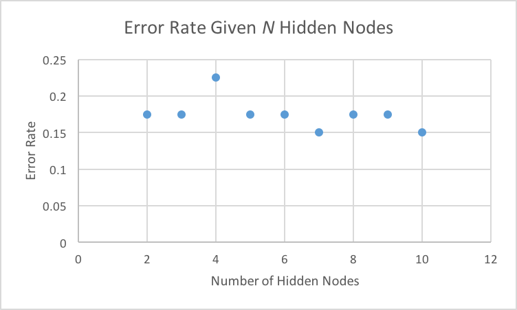

Analyzing The Network
=====================

Holdout Percentage & Error Rates
--------------------------------

When this ANN is run, it processes the input data and uses it to both train the network as well as test it. We call the percentage of input data that was used for testing instead of training the **holdout percentage**. To test its correlation to the reported error rates, the holdout percentage was changed a number of times and the error rate of the test data was recorded:

| Holdout Percentage (%)  | Error Rate    |
| ----------------------- | ------------- |
| 5                       | 0.3000        |
| 10                      | 0.2500        |
| 15                      | 0.2000        |
| 20                      | 0.1750        |
| 25                      | 0.1600        |
| 30                      | 0.2000        |
| 35                      | 0.1714        |
| 40                      | 0.1875        |
| 45                      | 0.2444        |
| 50                      | 0.2300        |
| 55                      | 0.2454        |
| 60                      | 0.2833        |
| 65                      | 0.2615        |
| 70                      | 0.2785        |
| 75                      | 0.2800        |
| 80                      | 0.2875        |
| 85                      | 0.2941        |
| 90                      | 0.3222        |
| 95                      | 0.3263        |

The result was an almost quadratic data set, with the error rates peaking at the lowest holdout percentage tested and the highest. The dip, or the lowest error point, occurred around 25% holdout. This proved that the holdout percentage must be about one fourth of the original data in order to achieve the most optimal (lowest) error rate. This provides the network with just enough data to accurately train with, as well as enough to validate its training and report accurate error rates.

Mapping The Data
----------------
To deduct the correlation between error rates and the number of hidden nodes used in the network, an ANN was tested with a variable number of hidden layer nodes ranging from 2 to 10. 80% of the input data was used to train the network, while 20% was used to test the network after it had been trained. The following trend was observed in running the experiment:

It was noticed that, throughout the tests, the error rate lingered around 17.5%, fluctuating only when the number of hidden layer nodes was 4, 7, and 10. This experiment revealed that there does not seem to be a strong correlation between the error rate and the number of hidden nodes. In a separate test, it was found that changing the amount of data used to train the network (or the holdout percentage) had an increased affect on the error rates reported.

Simplifying Assumptions
-----------------------
In designing this ANN, a couple assumptions needed to be made in order to ensure optimal performance:

### _"Users will be careful with hidden nodes"_
The most prominent assumption made is that users will not push the network past the physical boundaries of their hardware. The code written in this program is designed to perform minimal testing with data sets that are of decent size and hidden layers that contain a reasonable amount of nodes. If you were to test the network with say, 1,000 hidden nodes on a data set containing 10,000 entries, the code might make your terminal freeze or cause your computer to sound like a space heater. In order to understand why, you must first understand what happens when we train data.

#### Training Data
When training data is passed to the ANN's `train()` method, a loop is run. This loop determines how long we must train before the network is "good enough". The overall error rate is presumed to be 1, and every time we hit a new low error rate, we update this value. However, there's a catch: if we reach a projected timeout (measured in loop cycles) and the value doesn't get any lower, we have found our lowest possible error rate and the weights from that error rate are reassigned as the weights of the neural network at the end of the loop. The function used to compute the timeout is as follows:

_(# of hidden nodes) 4_

which computes a value high enough to ensure we provide the training method enough time to find the lowest value. However, if we use our previous example of 1,000 hidden nodes...

_1,000 4 = 1,000,000,000,000_

which is a very, *very* long time. Such a timeout is so large, there's a chance that you could fry an egg on the surface of your laptop by the time it had the chance to finish. So, as stated, it has to be assumed that the people using this ANN won't be, well, *too* ambitious.

### _"Users should know matrices aren't magic"_
When it comes to ANN's, matrices are fast. How else could you handle such large feature vectors, used in image recognition and speech processing? Surely you wouldn't loop through input hundreds and hundreds of times. That's just wasteful. However, when it comes to *this* ANN, we still have to assume users aren't going to push the limits of their systems (going off our previous assumption). If you input a 60,000 x 60,000 matrix with a projected output of size 50 x 60,000, that's going to eat up a lot of memory. Especially on a dinky consumer computer. As a result, we had to code the ANN hoping that users wouldn't try crunching big data, because it is not designed for that. We also needed to assume that whatever output the user is expecting is not a decimal. This ANN rounds all of its output to the nearest whole number, so precise decimal outputs are not possible without modifying the codebase.
